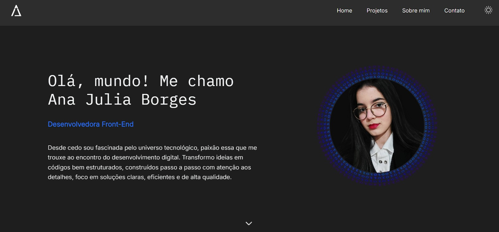

# Portfólio 👩‍💻


Portfólio pessoal e profissional exibindo projetos desenvolvidos ao longo de estudos, assim como seções de descrição, contato e modo escuro/claro.

## Sobre 📄

O Projeto Portfólio foi criado de forma independente utilizando das ferramentas e linguagens aprendidas anteriormante, nele o foco é prático em construção de um código limpo com ênfase na usabilidade. O site se adapta responsivamente a qualquer dispositivo em que for acessado, bem como armazena preferências do usuário em relação a modo escuro ou claro selecionados. O desenvolvimento desse web site prioriza também a acessibilidade, pensado na experiência de todos o visitam.

## Tecnologias e Métodos 🌐

- HTML5
- CSS3
- JavaScript ES6
- Figma
- DOM
- Eventos e Animações
- localStorage

## Execução 🚀

```bash
git clone https://github.com/ajborgesdev/meu-portfolio.git
